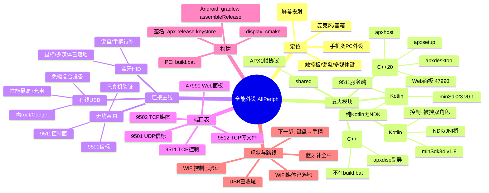

# 全能外设（AllPeriph）项目思维导图

> 用 `/mindmap` 命令可重生成。本图帮你把"脑子乱"的部分理顺：模块边界、连接主线、端口、构建、现状一眼看全。

## 这张图解决了什么
- 把"三个端 + 一个共享协议库"的边界讲清，避免再混淆 app/tv/host/display 谁负责什么。
- 三条连接主线（USB / Wi‑Fi / 蓝牙）并列，对应你之前问的"两台手机互控/互传"都落在 **Wi‑Fi 主线（9511+9512+9501）** 上。
- 端口表让你一眼定位"控制/传文件/信标/媒体/面板"各自走哪个口，调试时不用再翻代码。
